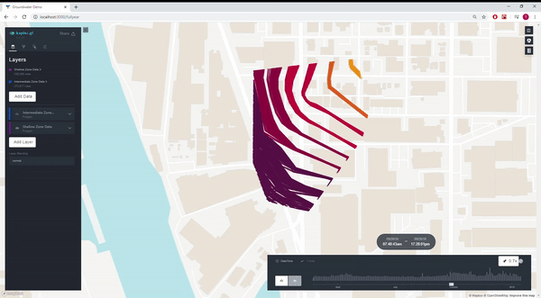

## Contouring

Contouring flat-file time-series Pressure Transducer data and conversion to a web uploadable format for visualization in Kepler.gl
 

## Uses
<b> Python </b>
- Pandas
- Geopandas
- Shapely
- Numpy
- Matplotlib


## Usage
```
from Contour import ContourData

cd = ContourData(
        'WellElevationSubset.xlsx',
        'X',
        'Y',
        "Water Elevation(ft NAVD88)",
        "DateTimeRounded",
        2926
)

cd.subsetData()
cd.contourData(subdivisions=5)
cd.extractGeometry()
cd.mergeGeometry()
cd.reproject()
cd.toGeoJSON("test.json")
```

## In Kepler.gl




