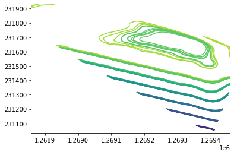

## Contouring

Contouring flat-file time-series Pressure Transducer data and conversion to a web uploadable format for visualization in Kepler.gl

<b> Surface Creation options include: </b>
 - Interpolation
   - cubic spline (default)
   - linear
 - Triangulation subdivision
 - Gaussian Process Regression (Kriging)
   - (RBF + Constant Kernels)

## Uses
<b> Python </b>
- Pandas
- Geopandas
- Shapely
- Numpy
- Matplotlib
- Scipy
- Scikit-learn


## Usage

<b> Input Data File </b>

Accepts Excel flat file format where one row corresponds to one groundwater elevation at one DateTime of the form:

| Location | DateTime        | X      | Y      | Z    |
|----------|-----------------|--------|--------|------|
| MW-1     | 2020-12-03 9:00 | 123453 | 435679 | 17.5 |
| ...      | ...             | ...    | ...    | ...  |


<b> Code Sample </b>
```
from Contour import ContourData

cd = ContourData(
        filepath = 'WellElevationSubsetSmaller.xlsx',
        xcol = 'X',
        ycol = 'Y',
        zcol = "Water Elevation(ft NAVD88)",
        tcol = "DateTimeRounded",
        crs = 2926,
        method = 'linear',
        steps = 50
)

cd.subsetData()
cd.contourData(subdivisions=5)
cd.extractGeometry()
cd.mergeGeometry()
cd.reproject()
cd.toGeoJSON("test.json")
```

## Efficiency
Interpolation methods increase run time significantly. If interpolating, set interpolation "steps" to largest possible size and triangulation subdivisions to lower values for fastest run time. Often larger step sizes provide a smoother contour line with an appropriate amount of subdivisions. 

Triangulation subdivision will run fastest, however spatially sparse data may provide undesirable results. 

## Output Looks like



## Animated In Kepler.gl


